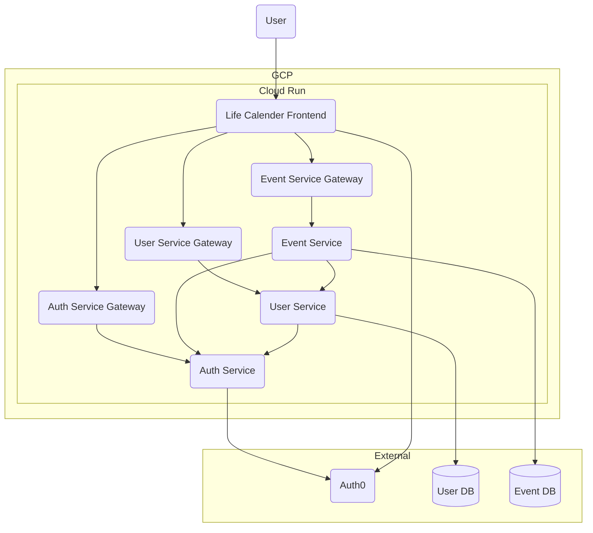

# Life Calendar

- [Life Calender Frontend](https://github.com/qkitzero/life-calendar-frontend)
- [Auth Service](https://github.com/qkitzero/auth-service)
- [User Service](https://github.com/qkitzero/user-service)
- [Event Service](https://github.com/qkitzero/event-service)

